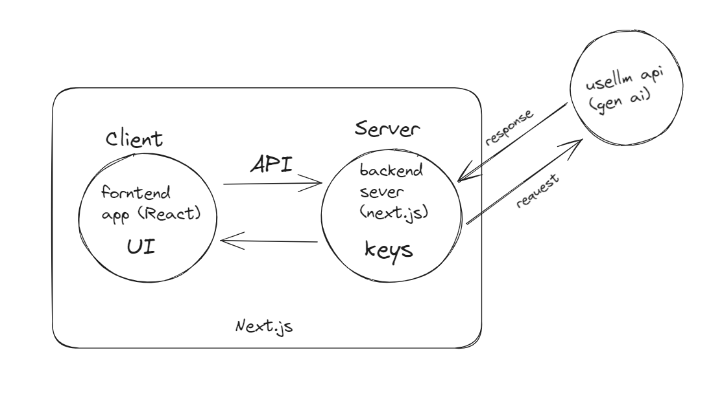

CODEGEN X AI:
CodegenXai is an innovative platform for coders, leveraging the power of large language models (LLMs) to enhance the coding experience. Built with React and Next.js, and integrating "usellm" as our core LLM, 
CodegenXai offers a suite of tools including a code optimizer, code summarizer, code reviewer, and code converter, all designed to streamline the development process.

Features: 

- **Code Optimizer**: Improve your code's efficiency by reducing compile time and memory usage without compromising functionality.
- **Code Summarizer**: Gain insights into your code with detailed explanations of functions and the overall working of your program.
- **Code Review**: Receive a code quality score out of 10, compare your code against LLM patterns, and get tips for improvement.
- **Code Converter**: Easily convert code between different programming languages, powered by our sophisticated LLM and OpenAI's APIs.

Installation:

Before you begin, ensure you have Node.js and npm installed. Then, follow these steps to set up CodegenXai:

1. Clone the repository:

```bash
git clone https://github.com/vijaysuryabaka/CodegenXai.git
cd CodegenXai
```
for installing the pacakages:
```
npm install
```
Set up Clerk for user management:
Please follow the official [Clerk documentation](https://clerk.dev/docs) to install Clerk in your Next.js application.

Connect to "usellm":
```
npm install usellm
```
Include instructions on how to set up and connect to the "usellm" LLM service. If there are any API keys or tokens involved, remind users to keep them secure and not to share them publicly.
Please follow the official [usellm documentation](https://usellm.org/docs) to install usellm and use it in your Next.js application.

How the LLM works:



create a file:
.env.local
```
NEXT_PUBLIC_CLERK_PUBLISHABLE_KEY=pk_test_ #clerk api
CLERK_SECRET_KEY=sk_test_ #clerk key
OPENAI_API_KEY=sk-lh   #openai key
```
To run this code:
```bash
npm run dev
```
Navigate to http://localhost:3000 in your browser to access the platform.
